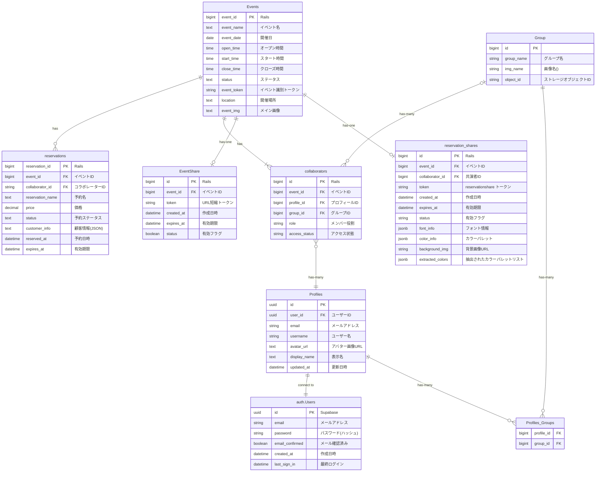

# ticket_reservation_system

# Readme

# 機能一覧

# 使用技術

- 会員登録機能
    - ログインログアウト
    - 非会員認証
- イベント作成機能
    - イベント作成、編集、削除
- コラボレーター機能
    - コラボレーター招待
    - 削除
- 予約機能
    - 予約作成、編集、削除
    - 予約招待ページ作成
    - 予約検索
    - 予約出力
- プロフィール機能
    - 表示名編集
    - メールアドレス変更
    - 

| フロント | Vue |
| --- | --- |
| CSSフレームワーク | Vuetify |
| バックエンド | Ruby on Rails |
| DB |  Postgres |
| DBサーバー・認証 | Supabase |
| デプロイ | Render |
| 開発環境 | Docker |

# ER図

# ユースケース

[Notion](https://www.notion.so/1ce5f23057f280b09028ee5cd2be7307?v=1ce5f23057f280529287000c3ed5e5de&pvs=4)

# こだわったところ

- Railsでサービスクラスを導入してみたところ
- バックエンドでもSupabaseのRLSポリシーを適用できるようにしたところ
- 認証やデータベースはSupabaseを使ってみたところ
- 予約受付ページをユーザーが動的に変更できるような構成にしているところ